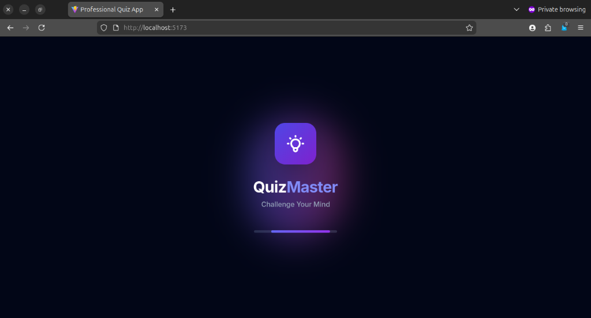

# QuizMaster - Premium React Quiz App

QuizMaster is a modern, visually stunning quiz application built with React, TypeScript, and Tailwind CSS. It features a premium user interface with glassmorphism effects, smooth animations, and a responsive design that works beautifully on all devices.



## 🚀 Features

- **Aesthetic Splash Screen**: A visually engaging animated entry point with a custom loading bar.
- **Modern UI/UX**: Premium glassmorphism design system with a vibrant indigo and slate palette.
- **Interactive Quiz Journey**: Real-time progress tracking, smooth transitions, and refined question cards.
- **Responsive Design**: Fully optimized for mobile, tablet, and desktop with vertical stacking on smaller screens.
- **TypeScript Powered**: Robust and type-safe codebase.
- **Fast Performance**: Built with Vite for an ultra-fast development experience.

## 🛠️ Tech Stack

- **Frontend**: React 19
- **Language**: TypeScript
- **Styling**: Tailwind CSS
- **Icons**: React Icons
- **State Management**: Zustand
- **Build Tool**: Vite

## 🏁 Getting Started

### Prerequisites

- Node.js (v18 or higher)
- npm or yarn

### Installation

1. **Clone the repository**:
   ```bash
   git clone https://github.com/ShuaibuPassionateProgrammer/react-quiz-app-advance-ts.git
   cd react-quiz-app-advance-ts
   ```

2. **Install dependencies**:
   ```bash
   npm install
   ```

3. **Start the development server**:
   ```bash
   npm run dev
   ```

4. **Open your browser**:
   Navigate to `http://localhost:5173` to see the app in action.

## 📖 Usage

- **Start the Quiz**: Once the app loads, the splash screen will transition to the main quiz interface.
- **Answer Questions**: Select the best option for each question.
- **Navigate**: Use the "Next" and "Previous" buttons to move through the quiz.
- **View Results**: Complete all questions to see your final score and performance summary.

## 📁 Project Structure

```text
src/
├── assets/          # Static assets
├── components/      # Reusable UI components
│   ├── Question.tsx # Main quiz question component
│   ├── Sidebar.tsx  # Progress tracking sidebar
│   ├── SplashScreen.tsx # Animated entry screen
│   └── ...
├── store/           # State management with Zustand
├── App.tsx          # Root application component
└── main.tsx         # Entry point
```

## 🤝 Contributing

Contributions are welcome! If you have any ideas for improvements or new features, feel free to open an issue or submit a pull request.

1. Fork the Project
2. Create your Feature Branch (`git checkout -b feature/AmazingFeature`)
3. Commit your Changes (`git commit -m 'Add some AmazingFeature'`)
4. Push to the Branch (`git push origin feature/AmazingFeature`)
5. Open a Pull Request

## 📄 License

This project is licensed under the MIT License.

---
Built with ❤️ by [Shuaibu](https://github.com/ShuaibuPassionateProgrammer)

